# COMS 4995 Applied Machine Learning Assignment 2 Report: From Trees to Neural Networks

## 1. Introduction
This report studies the **Bank Marketing** dataset and compares two model families on the same binary classification task: predicting whether a client will subscribe to a term deposit (`y`). The original dataset contains **45,211 rows** and **17 columns**. After removing rows with missing `job` and `education`, the working dataset contains **43,193 rows**. The positive class is relatively rare: the subscription rate is about **11.7%**, so this is an imbalanced classification problem.

In addition to accuracy, I compared **precision, recall, F1-score, and AUC-PR**, because these metrics are more informative when positives are uncommon. The two model families were:

1. **Gradient Boosted Decision Trees (XGBoost)**, which are usually strong for tabular data with mixed feature types.
2. **Multi-Layer Perceptrons (MLP)**, which can model non-linear interactions but are more sensitive to optimization and feature scaling.

The overall goal was not just to find the higher score, but to understand how each model behaves under different hyperparameter settings, what that says about bias-variance trade-offs, and which model is more suitable for this tabular prediction task.

## 2. Data Preparation
### 2.1 Cleaning and consistency checks
The notebook first checked each column for missing values and invalid entries. The main cleaning decisions were:

1. Drop rows with missing `job` and `education`.
2. Replace missing `contact` values with `unknown`.
3. Replace missing `poutcome` values with `unknown`.
4. Keep numeric columns after verifying they were valid.

Given the description provided by the website, we did not find any inconsistent types and values besides the missing ones. I decided to drop rows for `job` and `education` since there are very few of them (**4%**). By comparison, I added `unknown` flag for missing values in `contact` and `poutcome`. The cleaning above reduced the dataset from 45,211 to 43,193 rows.

### 2.2 Encoding
Several deterministic encoding steps were applied before modeling:

1. Binary mapping (`yes`/`no` to `1`/`0`) for `default`, `housing`, `loan`, and the target `y`.
2. Convert `month` and `day_of_week` into a single `day_of_year` feature. For example, January 5th is **5** and February 10th is **41**
3. Group `job` into broader categories: `professional`, `manual`, and `other`.
4. One-hot encode the remaining nominal variables: `job`, `marital`, `education`, `contact`, and `poutcome`.

After the calendar conversion, `day_of_year` was further transformed into:

1. **Cyclical features**: `day_sin` and `day_cos`, so dates near the end and beginning of the year remain close in feature space.
2. **Season indicators**: one-hot encoded `spring`, `summer`, `autumn`, and `winter`.

The reason for that is I noticed periodic distribution in each season throughout the year. Therefore we construct these new columns and drop `day_of_year`

This produced a final feature matrix with **32 columns** including the target.

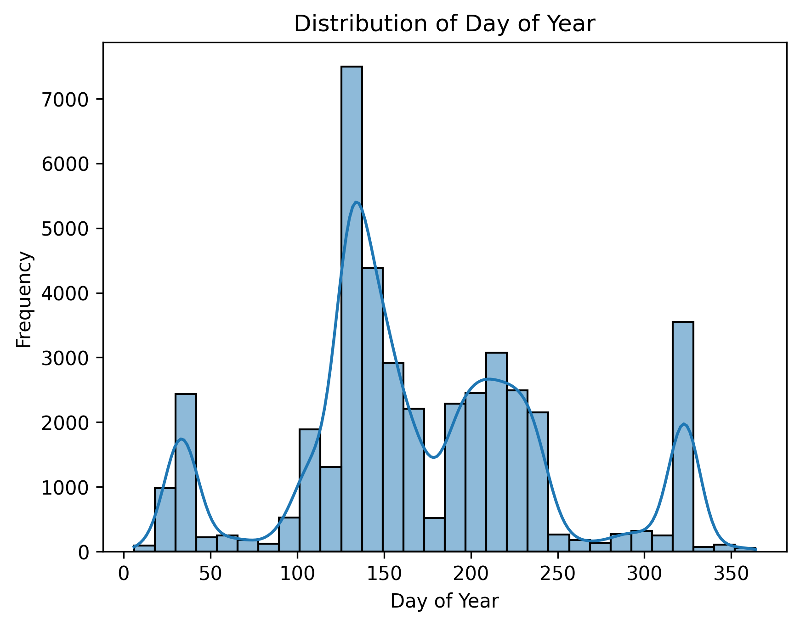

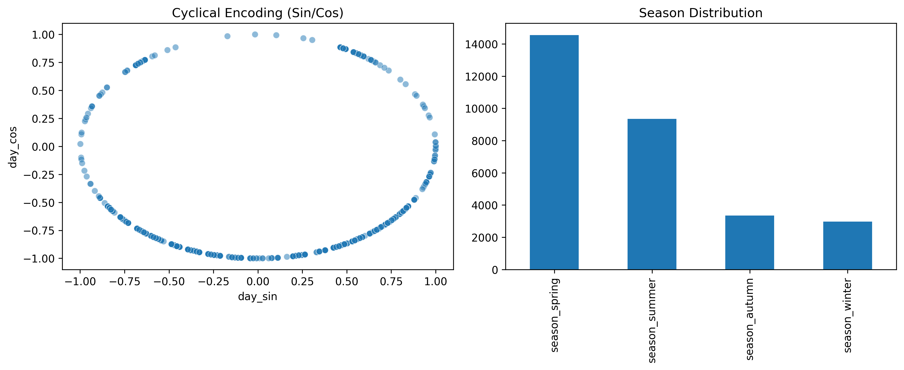

*Figure 1. Calendar information was encoded both cyclically (`sin`/`cos`) and categorically through seasons.*

### 2.3 Train/validation/test split
The cleaned data was split into **70%-15%-15%**:

1. **Training**: 30,235 rows
2. **Validation**: 6,479 rows
3. **Test**: 6,479 rows

### 2.4 Scaling for MLP
As emphasized in the neural network lecture, MLPs are sensitive to feature scale because optimization is performed with gradient-based updates. Tree models split on thresholds and are much less sensitive to monotonic rescaling, so the heavy scaling pipeline was mainly necessary for the MLP branch.

The notebook fit all learned transformations on the **training split only** and then applied them to validation and test data. Different numeric variables received different treatments:

1. `age` and `balance`: standardization.
2. `duration`: `log(1+x)` transform, then standardization.
3. `campaign`, `previous`, and `pdays`: quantile transformation toward a Gaussian-like distribution, then standardization.

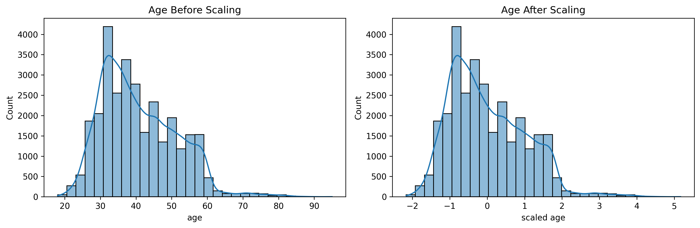
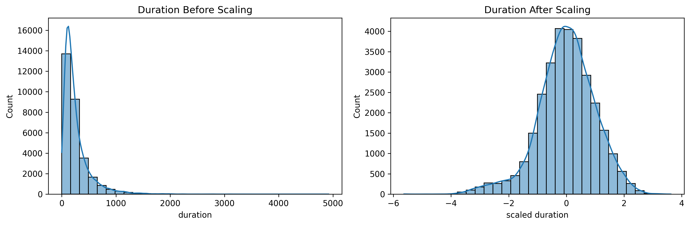
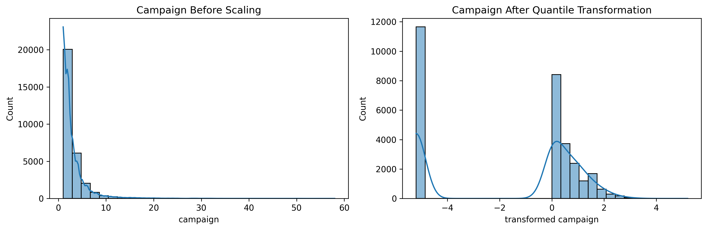

*Figure 2. Example of why scaling is useful for MLP training: the standardized version is centered and easier for gradient-based optimization.*

## 3. Gradient Boosted Decision Trees (XGBoost)
### 3.1 Base model
The base XGBoost configuration was:

| Hyperparameter | Value |
| --- | --- |
| `learning_rate` | 0.05 |
| `n_estimators` | 1000 |
| `max_depth` | 4 |
| `subsample` | 0.8 |
| `colsample_bytree` | 0.8 |
| `reg_alpha` | 0 |
| `reg_lambda` | 1 |
| `eval_metric` | `logloss` |
| `early_stopping_rounds` | 50 |

Early stopping selected **best iteration 386**, which already suggests the full 1000 trees were unnecessary and that validation monitoring helped control variance.

The base test performance was:

| Metric | XGBoost base |
| --- | --- |
| Accuracy | 0.9150 |
| Precision | 0.6826 |
| Recall | 0.4960 |
| F1 | 0.5745 |
| AUC-PR | 0.6570 |
| Training time | 0.6332 s |

The confusion matrix and PR curve show that the model achieved good precision while still recovering about half of the positive cases.

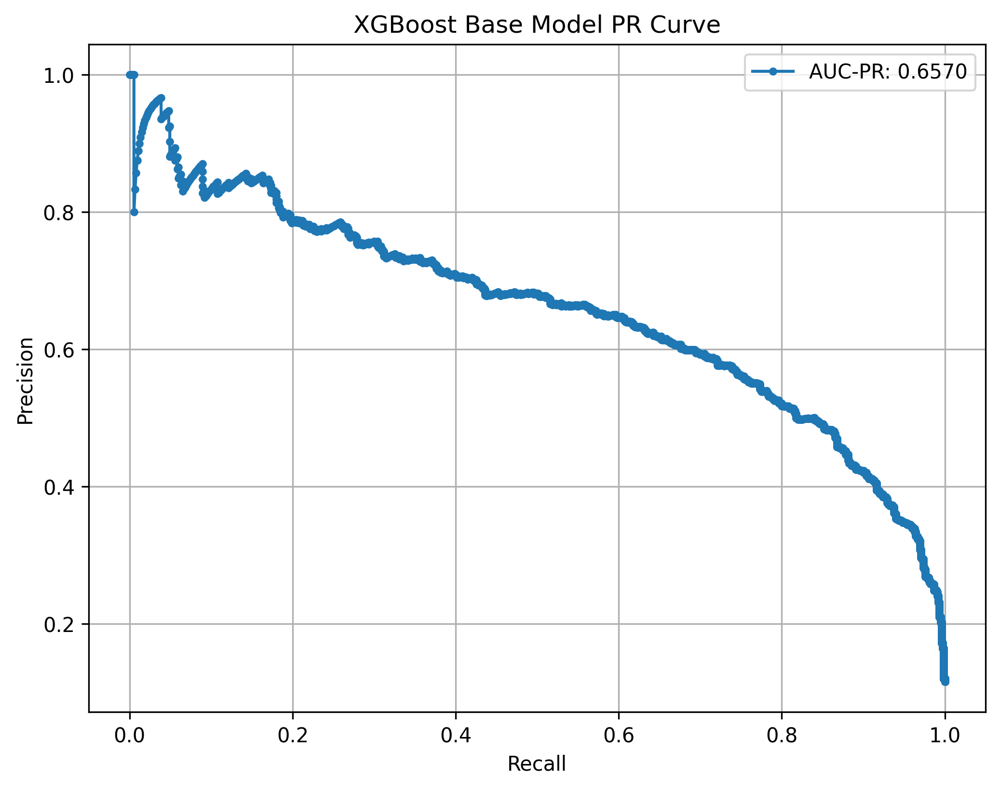

*Figure 3. Precision-recall behavior of the base XGBoost model on the held-out test set.*

### 3.2 Training dynamics and learning rate
The log-loss curves show the expected pattern from boosting: training loss falls steadily, while validation loss improves at first and then flattens, making early stopping appropriate.

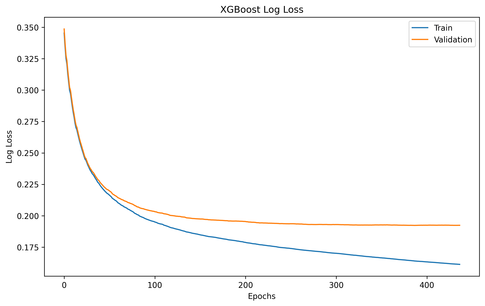

*Figure 4. Training and validation log loss for the base XGBoost model.*

I also compared several learning rates. A smaller learning rate required many more boosting rounds, while an overly aggressive learning rate converged faster but slightly hurt generalization. Among the tested values, **0.05** gave the best overall balance:

| Learning rate | Best iteration | Accuracy | F1 | AUC-PR |
| --- | --- | --- | --- | --- |
| 0.01 | 998 | 0.9133 | 0.5504 | 0.6483 |
| 0.05 | 386 | 0.9150 | 0.5745 | 0.6570 |
| 0.10 | 234 | 0.9111 | 0.5583 | 0.6532 |
| 0.30 | 72 | 0.9137 | 0.5697 | 0.6500 |

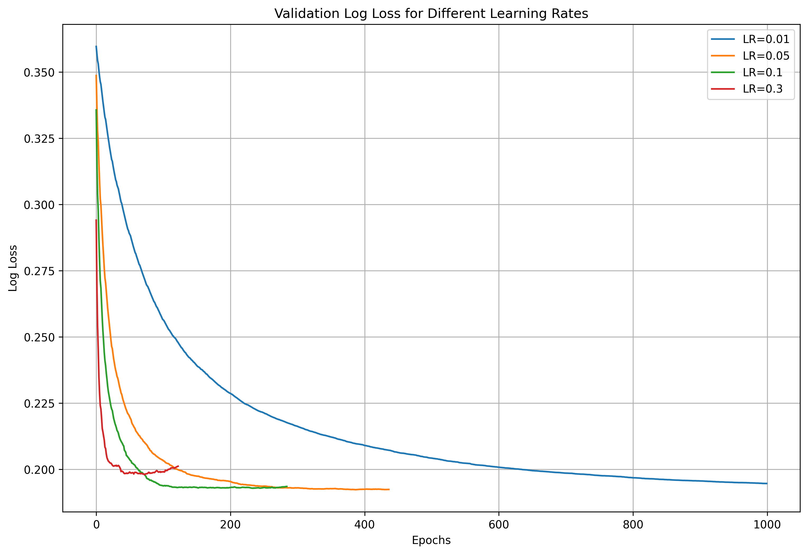

*Figure 5. Validation log-loss curves for multiple learning rates. `0.05` gave the most favorable trade-off in this notebook.*

### 3.3 Hyperparameter effects
I also tested varied depth, subsampling, regularization, and number of estimators. To make the comparisons explicit, the tables below report held-out test metrics when changing one parameter at a time from the XGBoost base configuration.

#### Max depth
| `max_depth` | Accuracy | Precision | Recall | F1 | Training time (s) |
| --- | --- | --- | --- | --- | --- |
| 3 | 0.9142 | 0.6865 | 0.4760 | 0.5622 | 0.7568 |
| 4 (base) | 0.9150 | 0.6826 | 0.4960 | 0.5745 | 0.6326 |
| 10 | 0.9111 | 0.6559 | 0.4880 | 0.5596 | 0.4603 |
| 15 | 0.9092 | 0.6546 | 0.4573 | 0.5385 | 0.7548 |

#### Subsample
| `subsample` | Accuracy | Precision | Recall | F1 | Training time (s) |
| --- | --- | --- | --- | --- | --- |
| 0.1 | 0.9109 | 0.6693 | 0.4560 | 0.5424 | 0.5578 |
| 0.5 | 0.9150 | 0.6832 | 0.4947 | 0.5739 | 0.4521 |
| 0.8 (base) | 0.9150 | 0.6826 | 0.4960 | 0.5745 | 0.6326 |
| 1.0 | 0.9130 | 0.6742 | 0.4800 | 0.5607 | 0.6446 |

#### L1 regularization
| `reg_alpha` | Accuracy | Precision | Recall | F1 | Training time (s) |
| --- | --- | --- | --- | --- | --- |
| 0 (base) | 0.9150 | 0.6826 | 0.4960 | 0.5745 | 0.6326 |
| 0.01 | 0.9126 | 0.6697 | 0.4840 | 0.5619 | 0.5798 |
| 0.1 | 0.9143 | 0.6726 | 0.5067 | 0.5779 | 0.6863 |
| 1.0 | 0.9162 | 0.6865 | 0.5080 | 0.5839 | 0.5962 |

#### L2 regularization
| `reg_lambda` | Accuracy | Precision | Recall | F1 | Training time (s) |
| --- | --- | --- | --- | --- | --- |
| 0.1 | 0.9165 | 0.6932 | 0.5000 | 0.5809 | 0.5412 |
| 1.0 (base) | 0.9150 | 0.6826 | 0.4960 | 0.5745 | 0.5861 |
| 10.0 | 0.9150 | 0.6826 | 0.4960 | 0.5745 | 0.6096 |

#### Number of estimators
| `n_estimators` | Accuracy | Precision | Recall | F1 | Training time (s) |
| --- | --- | --- | --- | --- | --- |
| 100 | 0.9102 | 0.7029 | 0.3880 | 0.5000 | 0.1857 |
| 500 | 0.9150 | 0.6826 | 0.4960 | 0.5745 | 0.6422 |
| 1000 (base) | 0.9150 | 0.6826 | 0.4960 | 0.5745 | 0.6326 |
| 1500 | 0.9150 | 0.6826 | 0.4960 | 0.5745 | 0.6414 |

The main patterns were:

1. **Deeper trees hurt performance**: increasing `max_depth` from 4 to 10 or 15 reduced both accuracy and F1, which is consistent with higher variance.
2. **Too few trees underfit**: `n_estimators = 100` sharply reduced recall and F1.
3. **Moderate regularization helped slightly**: `reg_alpha = 1.0` achieved the best F1 among these variants (**0.5839**), slightly above the base model.
4. **Subsample changes had modest effect**: values around 0.5 to 0.8 were stable, while 0.1 was weaker.

These results align with the lecture intuition that shallow boosted trees often generalize better on tabular data than very deep trees.

### 3.4 Feature importance
The gain-based feature importance plot shows that the strongest signals came from:

1. `poutcome_success`
2. `duration`
3. `contact_unknown`
4. `poutcome_unknown`
5. `housing`

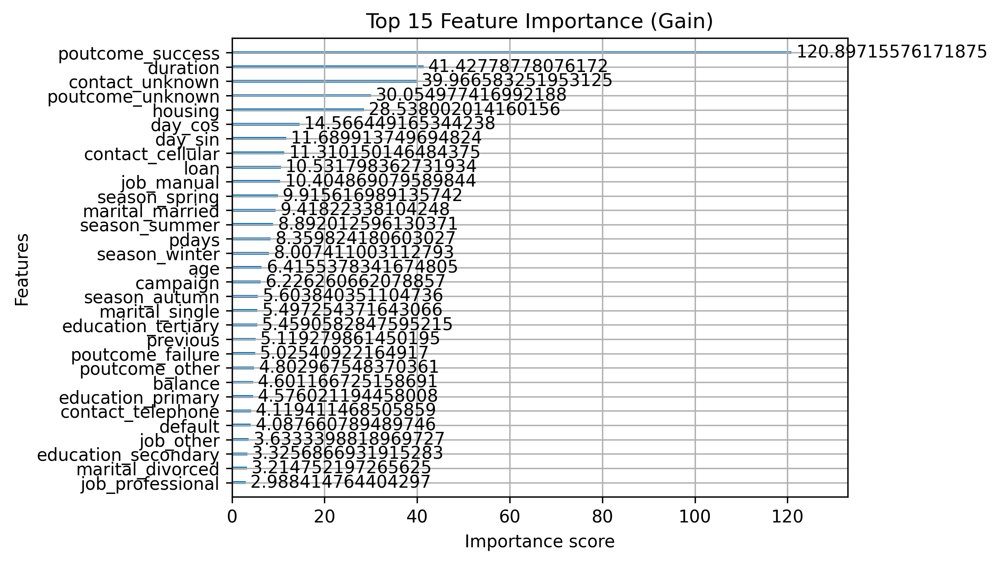

*Figure 6. Gain-based feature importance for the XGBoost model.*

This ranking is interpretable and consistent with domain intuition. Past campaign outcome and call duration are both highly relevant to deposit subscription. At the same time, `duration` should be interpreted carefully because the dataset documentation notes that it is only available after the call ends, so it is useful for benchmark performance but weaker for a truly deployable pre-call model.

## 4. Multi-Layer Perceptron (MLP)
### 4.1 Tuned MLP setup
For the MLP, I used `GridSearchCV` with **3-fold stratified cross-validation** on the training split. The search space was:

1. `hidden_layer_sizes`: `(64, 32)`, `(128, 64)`, `(128, 64, 32)`
2. `activation`: `relu`, `tanh`
3. `alpha`: `0.001`, `0.01`, `0.1`
4. `learning_rate_init`: `0.001`, `0.01`, `0.1`, `1.0`
5. `max_iter`: `100`, `300`, `500`

The best cross-validated configuration was:

| Hyperparameter | Value |
| --- | --- |
| `hidden_layer_sizes` | `(64, 32)` |
| `activation` | `relu` |
| `alpha` | 0.01 |
| `learning_rate_init` | 0.001 |
| `max_iter` | 100 |
| `early_stopping` | True |
| `n_iter_no_change` | 20 |

The best CV F1 was **0.5380**.

### 4.2 Tuned MLP test performance
The tuned MLP achieved:

| Metric | Tuned MLP |
| --- | --- |
| Accuracy | 0.9052 |
| Precision | 0.6298 |
| Recall | 0.4400 |
| F1 | 0.5181 |
| AUC-PR | 0.6002 |
| Grid-search time | 228.8298 s |

Compared with XGBoost, the MLP was respectable but consistently weaker on the held-out test set across all major metrics.

### 4.3 One-parameter MLP tables
To mirror the XGBoost analysis, I also changed one MLP hyperparameter at a time around the tuned configuration and evaluated each model on the held-out test set.

#### Activation
| `activation` | Accuracy | Precision | Recall | F1 | AUC-PR | Training time (s) |
| --- | --- | --- | --- | --- | --- | --- |
| `relu` (base) | 0.9052 | 0.6298 | 0.4400 | 0.5181 | 0.6002 | 3.6097 |
| `tanh` | 0.9075 | 0.6286 | 0.4920 | 0.5520 | 0.6080 | 4.2408 |

#### Alpha
| `alpha` | Accuracy | Precision | Recall | F1 | AUC-PR | Training time (s) |
| --- | --- | --- | --- | --- | --- | --- |
| 0.001 | 0.9060 | 0.6318 | 0.4507 | 0.5261 | 0.5996 | 2.7967 |
| 0.01 (base) | 0.9052 | 0.6298 | 0.4400 | 0.5181 | 0.6002 | 3.3832 |
| 0.1 | 0.9063 | 0.6341 | 0.4507 | 0.5269 | 0.6031 | 3.4342 |

#### Learning rate
| `learning_rate_init` | Accuracy | Precision | Recall | F1 | AUC-PR | Training time (s) |
| --- | --- | --- | --- | --- | --- | --- |
| 0.001 (base) | 0.9052 | 0.6298 | 0.4400 | 0.5181 | 0.6002 | 3.5621 |
| 0.01 | 0.9045 | 0.6287 | 0.4267 | 0.5083 | 0.5837 | 2.0579 |
| 0.1 | 0.9035 | 0.6457 | 0.3693 | 0.4699 | 0.5513 | 1.5160 |
| 1.0 | 0.8842 | 0.0000 | 0.0000 | 0.0000 | 0.5579 | 1.2660 |

#### Maximum iterations
| `max_iter` | Accuracy | Precision | Recall | F1 | AUC-PR | Training time (s) |
| --- | --- | --- | --- | --- | --- | --- |
| 100 (base) | 0.9052 | 0.6298 | 0.4400 | 0.5181 | 0.6002 | 3.6799 |
| 300 | 0.9052 | 0.6298 | 0.4400 | 0.5181 | 0.6002 | 3.4945 |
| 500 | 0.9052 | 0.6298 | 0.4400 | 0.5181 | 0.6002 | 3.5106 |

### 4.4 Learning dynamics
The loss-curve figure shows that the MLP is sensitive to learning rate. A moderate learning rate reduces loss quickly, while a higher learning rate plateaus early at a worse loss value.

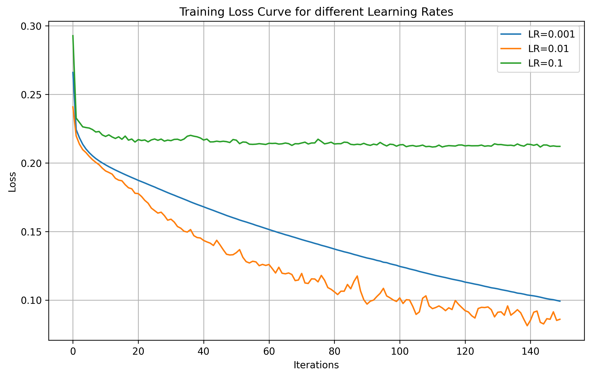

*Figure 7. MLP training loss under different learning rates. Larger learning rates converged faster initially but were less stable and settled at worse loss.*

### 4.5 Network architecture effects
The architecture sweep showed that simply making the network deeper did not guarantee better test performance:

| Architecture | Accuracy | Precision | Recall | F1 | Training time (s) |
| --- | --- | --- | --- | --- | --- |
| `(64,)` | 0.9079 | 0.7040 | 0.3520 | 0.4693 | 1.2400 |
| `(128,)` | 0.9055 | 0.6228 | 0.4667 | 0.5335 | 2.2798 |
| `(64, 32)` | 0.9052 | 0.6298 | 0.4400 | 0.5181 | 3.2017 |
| `(128, 64)` | 0.9057 | 0.6415 | 0.4200 | 0.5077 | 5.0644 |
| `(128, 64, 32)` | 0.9080 | 0.6878 | 0.3760 | 0.4862 | 5.6735 |

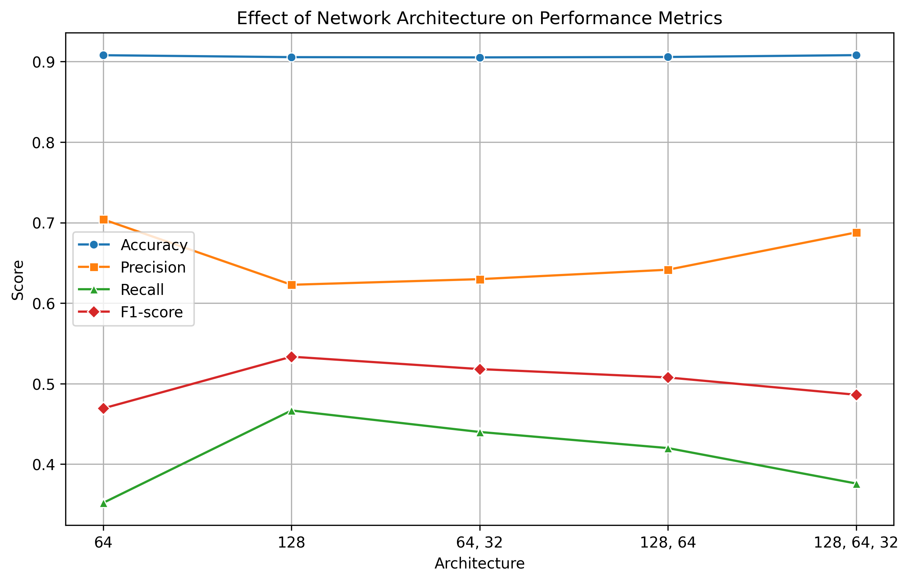
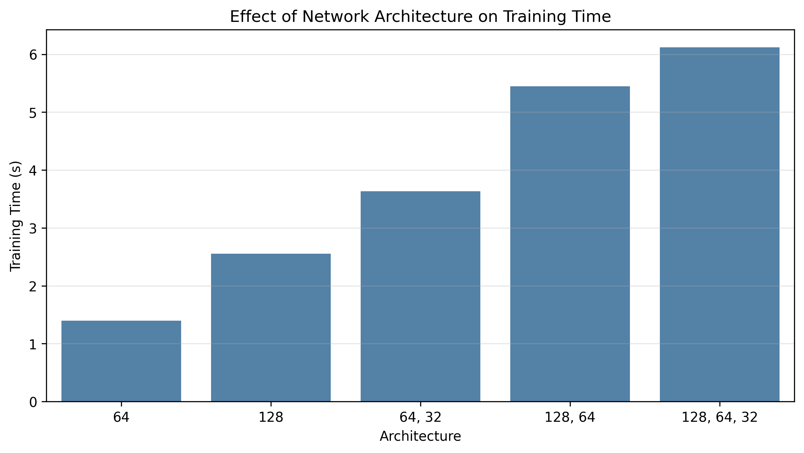

*Figure 8. Changing depth and width shifted the precision-recall trade-off, but deeper networks were not automatically better.*

Two observations stand out:

1. The shallow `(128,)` network gave the best held-out F1 in this sweep (**0.5335**), even though the best cross-validated configuration selected `(64, 32)`.
2. Deeper networks cost more time but did not produce better generalization, suggesting extra capacity mainly increased variance rather than improving the bias term enough to help.

## 5. GBDT vs. MLP Comparison
### 5.1 Side-by-side metrics
Using the same task and held-out test set, the final comparison is:

| Model | Accuracy | Precision | Recall | F1 | AUC-PR |
| --- | --- | --- | --- | --- | --- |
| XGBoost | 0.9150 | 0.6826 | 0.4960 | 0.5745 | 0.6570 |
| MLP | 0.9052 | 0.6298 | 0.4400 | 0.5181 | 0.6002 |

XGBoost outperformed MLP on every reported metric.

### 5.2 Training-time comparison
For direct model fitting, XGBoost was also faster:

| Model | Approximate fit time |
| --- | --- |
| XGBoost base model | 0.6332 s |
| MLP `(64, 32)` fit | 3.2017 s |

If I include the full MLP hyperparameter search, the total tuning cost rises to **228.83 s**, so the practical gap is even larger.

### 5.3 Required discussion points
#### When would I prefer GBDT over MLP, and vice versa?
I would prefer **GBDT/XGBoost** for this kind of problem because the Bank Marketing dataset is classic tabular business data with mixed feature types, moderate dimensionality, and non-linear threshold effects. In this setting, boosted trees usually give strong performance with less feature engineering and much less tuning. That pattern appeared clearly in this assignment: XGBoost achieved better held-out accuracy, F1, and AUC-PR while training faster than the MLP.

I would prefer an **MLP** when the inputs are already well-scaled, mostly continuous, and there is reason to believe that learned distributed representations matter more than rule-like threshold splits. MLPs can also become more attractive when the feature space is large and dense, or when the task is part of a broader neural pipeline. However, on this dataset, the MLP needed much more tuning and still did not surpass XGBoost.

#### How does interpretability differ?
The two models differ substantially in interpretability. **GBDT is easier to interpret** because it provides feature importance scores directly, and tree-based decision logic can be explained in terms of threshold splits. In this notebook, XGBoost highlighted `poutcome_success`, `duration`, `contact_unknown`, `poutcome_unknown`, and `housing` as the most influential features, which makes the model behavior easier to analyze and justify.

By contrast, **MLP is much closer to a black box**. Although we can inspect metrics, loss curves, and sometimes weights, it is much harder to explain why a specific prediction was made or which features were most responsible in a human-readable way. This makes MLP less suitable when interpretability is an important practical requirement.

#### How does each model handle categorical features and missing values?
For **categorical features**, both models in this assignment ultimately used encoded numeric inputs, but they react differently to that representation. GBDT generally handles one-hot encoded tabular features very naturally because tree splits can isolate useful categories without requiring a smooth geometric structure. MLP, in contrast, treats encoded columns as part of a continuous optimization problem, so it is more sensitive to how categories are represented and scaled.

For **missing values**, tree-based boosting methods are usually more forgiving and can often work well with simpler preprocessing pipelines. In practice, XGBoost is much closer to being "tabular-native." MLP is less tolerant of missingness because neural networks require a clean numeric matrix as input, so missing values must be imputed or otherwise resolved before training. In this notebook, I explicitly cleaned or filled missing values before both models, but that preprocessing burden mattered more for the MLP.

#### Which model is more sensitive to hyperparameter choices?
The **MLP was more sensitive to hyperparameters** in this experiment. Its behavior changed substantially with architecture, learning rate, activation, and regularization. For example, increasing `learning_rate_init` too much sharply reduced F1, and at `1.0` the model collapsed to predicting no positive cases at all. Deeper or wider architectures also increased runtime without guaranteeing better generalization.

XGBoost was also affected by hyperparameters, especially `max_depth`, `learning_rate`, and regularization, but its behavior was noticeably more stable. Moderate tuning was enough to get strong results, and early stopping reduced the risk of overfitting. Overall, the assignment supports the conclusion that **MLP has the higher hyperparameter sensitivity**, while **GBDT is more robust on structured tabular data**.

## 6. Discussion
### 6.1 Bias-variance interpretation
This assignment clearly reflected the bias-variance ideas from lecture:

1. **XGBoost**: deeper trees increased variance and hurt test F1, while moderate regularization and early stopping improved generalization.
2. **MLP**: larger or deeper networks did not automatically help and were more sensitive to learning rate, regularization, and architecture choices.

In other words, both model families can overfit, but the MLP required much more tuning to approach the performance that XGBoost achieved more reliably.

### 6.2 Limitations
There are several limitations in this experiment:

1. The report uses a single hold-out test split rather than repeated resampling.
2. The dataset is imbalanced, so threshold tuning could improve recall or F1 further.
3. `duration` is a strong predictor but is only available after a call has happened, which makes the benchmark somewhat optimistic for real deployment.
4. The final XGBoost comparison used the notebook's base configuration, even though a few regularized variants gave slightly better F1.

## 7. Conclusion
On this Bank Marketing task, **XGBoost was the better model family**. It achieved the best accuracy, precision, recall, F1, and AUC-PR, and it did so with much less tuning and much shorter runtime than the MLP. The experiment also matched the lecture intuition: for structured tabular data, boosted tree ensembles usually provide the strongest balance of flexibility, robustness, and interpretability.

The MLP still learned useful non-linear structure, but its performance was more fragile with respect to scaling, learning rate, and architecture. This makes it a reasonable baseline, but not the preferred model for this particular dataset.

## 8. AI Tool Disclosure
### I use the ChatGPT 5.4 for the following assistance:
1. Assistance in Cyclical and Seasonal Features for `day_of_year` transformation.
2. Assistance in heavily skewed data distribution with Quantile Scaler to achieve standardized distribution.
3. Self-automated code to test out different paramters given the case model so I don't have to write the code again.
4. Generate and saved plots that will be used for report.
5. Generated a structural outline of report. However, I double checked everything to make sure is accurate, including changing some minor details in analysis.
6. Everything else was my own contribution. 
